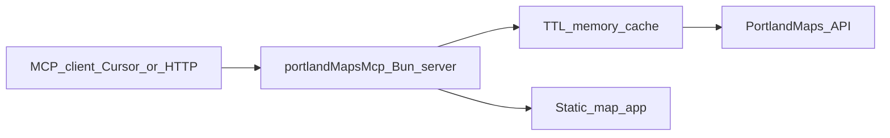

# PortlandMaps MCP — revised hackathon build plan

> **Repo note:** This document was copied from the Cursor plan. **Phase 2 tools** (`resolve_address`, `get_property_overview`, `get_hazard_profile`, `ping`) are restored in `src/`; phases 3–5 remain future work.

**Starting point:** Workspace **portland-maps-mcp** (folder name). **MCP implementation / service id:** `portlandMapsMcp` — used for `package.json` `name`, `McpServer` metadata, `/health` JSON `service`, and log prefix `[portlandMapsMcp]`. **Phases 1–2** are implemented in-repo (HTTP + PortlandMaps address / overview / hazards); phases 3–5 remain as below.

**Data path:** **Plan A** ([PortlandMaps API docs](https://www.portlandmaps.com/development/)): `GET https://www.portlandmaps.com/api/suggest/`, `GET https://www.portlandmaps.com/api/detail/`, and `GET https://www.portlandmaps.com/api/permit/` for permit search. Property-scoped permit lists align with `detail_type=permits` and **`detail_id` = taxlot `property_id`** (per docs table: `permits` | Taxlots Property ID).

**Transport:** **HTTP MCP (Streamable HTTP)** on `HOST`/`PORT` via `WebStandardStreamableHTTPServerTransport` — endpoint **`/mcp`**, plus **`GET /health`**. Cursor config example key: `portlandMapsMcp` (see [README.md](../README.md)). *Optional follow-up:* add **stdio** entry or flag for Claude Desktop without HTTP (not shipped yet).

**Default port:** Use **`PORT=3001`** in [`.env.example`](../.env.example). Read host/port from env everywhere.

**Secrets layout (when PortlandMaps is enabled):**

- [`.env.example`](../.env.example): `PORTLANDMAPS_API_KEY=`, `PORT=3001`, `HOST=127.0.0.1`. (A future **Plan B** could add `PROVIDER=arcgis`.)
- [`.gitignore`](../.gitignore): **`.env.local`** is ignored; copy `.env.example` → `.env.local` for secrets.
- **Env load:** [src/config.ts](../src/config.ts) reads `.env` then **`.env.local`** (local overrides keys it defines).

---

## Architecture (concise)

- **[src/server.ts](../src/server.ts):** `Bun.serve`; **`/mcp`** → `WebStandardStreamableHTTPServerTransport` + `createMcpServer()`; **`/health`**; use **`idleTimeout: 0`** for SSE (see Bun docs).
- **[src/registerTools.ts](../src/registerTools.ts):** `McpServer` **`name: "portlandMapsMcp"`**; register tools (`ping`, `resolve_address`, `get_property_overview`, `get_hazard_profile`, etc.).
- **Provider layer (when restored):** Portland `suggest` / `detail` HTTP + normalization (aligned with original hackathon plan §4 / §7).
- **Cache (when restored):** TTL cache (~1h) on URL keys for suggest/detail.
- **`public/map.html`** (or static route): **simple map app** — query params `lat`, `lng`, optional `layers=zoning,hazards` — OSM + Leaflet via CDN or ArcGIS export image; no heavy build step.

---

## Phased execution (optimized for “server up in hours”)

### Phase 1 — **Bootable server (first ~45–60 min)** — **done** (historical)

**Goal:** `bun install` → `bun run dev` → process listens on `PORT`, MCP handshake works, one trivial tool proves wiring.

- Bun + TypeScript: [package.json](../package.json) **`name: "portlandMapsMcp"`**, [tsconfig.json](../tsconfig.json), [src/server.ts](../src/server.ts).
- Dependencies: `@modelcontextprotocol/sdk`, `zod`.
- **`ping`** tool (API key present vs missing).
- **`GET /health`** + Streamable HTTP **`/mcp`** + README Cursor URL snippet (`portlandMapsMcp`).

**Exit criteria:** External client can list tools and call `ping` over HTTP on `PORT`.

---

### Phase 2 — **Address + property + hazards (next ~90–120 min)** — **done** (historical)

**Goal:** Core “should I care about this address?” story, wired to **real** `suggest` + `detail` calls.

1. **`resolve_address`** — `GET /api/suggest/` (`count`, `alt_coords` + `alt_ids`); JSON candidates + HTML disambiguation.
2. **`get_property_overview`** — parallel `detail` for assessor, zoning, leaf-day, property, neighborhood/council follow-ups when IDs exist, school + park via **`x_y` web mercator**, six hazard summary chips.
3. **`get_hazard_profile`** — six `hazard-*` detail types; HTML hazard panel.
4. **HTML + text** — multiple `content` items (summary + JSON + HTML where useful).

**Exit criteria:** For one known-good Portland address, all three tools return coherent text + UI without throwing.

---

### Phase 3 — **Permits + “violations / enforcement” angle (~60–90 min)**

**Goal:** Tools that support **economic / activity signals** for buyers and researchers.

1. **`get_property_permits`** — primary: `GET /api/detail/?detail_type=permits&detail_id={property_id}&sections=*&format=json&api_key=…`. Normalize to a short list (type, status, dates, IVR / application # if present).
2. **`search_permits`** (optional) — `GET /api/permit/` with filters on [development](https://www.portlandmaps.com/development/) (date range, `search_type_id`, address fields).
3. **“Violations” framing:** Portland’s permit search includes **enforcement** categories (Construction Code, Housing, Nuisance, etc.). Label as **code enforcement / cases** in UI copy.

**Exit criteria:** For a property with known permit history, tool returns non-empty structured rows + human summary.

---

### Phase 4 — **Simple map “MCP App” tied to tools (~45–60 min)**

**Goal:** Judges see a **map**, not only tables.

- Serve **`/map`** (or `/app/map`) from the same Bun server as `map.html` with `lat`/`lng` query params.
- **`show_location_map`** tool: `lat`, `lng`, `displayAddress`; text + link `http://{HOST}:{PORT}/map?lat=…&lng=…`; HTML iframe or static preview image.

**Exit criteria:** From a client, calling the tool shows map context for the same coordinates used in overview/hazards.

---

### Phase 5 — **Demo hardening (~30–45 min parallelizable)**

- Pick **one anchor address** and **pre-warm** cache at startup.
- Add `demo/seed.json` or inline seed for fallback if API hiccups during judging.
- README: **60-second judge script** + MCP config + env instructions.
- Log `X-Rate-Limit-*` headers; on 429, degrade to cache/short message.

---

## Scope discipline (hackathon)

- **Defer Plan B (ArcGIS-only)** unless the keyed API fails during the event; optional `PROVIDER` switch later.
- **Do not** add extra tools beyond: resolve, overview, hazards, permits (+ optional search), map — until Phases 1–4 are green.
- **“MCP App”** here means: **host-provided mini web UI + tool surfaces it** (iframe/link).

---

## Key files (target layout when full stack is restored)

| Area        | Role        | Files |
| ----------- | ----------- | ----- |
| Entry       | HTTP + MCP | `package.json`, `tsconfig.json`, `src/server.ts` |
| Config      | Env         | `src/config.ts`, `.env.example`, `.gitignore` |
| Data        | Portland API | `src/providers/types.ts`, `src/providers/portlandMapsProvider.ts`, `src/cache.ts`, `src/geo.ts` |
| Tools       | MCP surface | `src/registerTools.ts` and/or `src/tools/*.ts` |
| UI          | HTML cards  | `src/ui/cards.ts` (or equivalent) |
| Map app     | Static page | `public/map.html` |
| Permits     | New tools   | e.g. `src/tools/getPropertyPermits.ts` |
| Demo        | Seeds + docs | `demo/seed.json`, `README.md` |

---

## Risk notes

- **SDK + Bun:** Pin a known-good `@modelcontextprotocol/sdk` version; confirm HTTP transport import paths.
- **Streamable HTTP + Cursor:** Multi-request flows may require **session routing** (`mcp-session-id`) or **stdio** transport; stateless one-shot servers can return **-32601**.
- **HTML in tools:** Ship strong plain text first; HTML is a bonus for rich hosts.
- **Permit / hazard payloads:** Tune field mappings empirically against live JSON.
